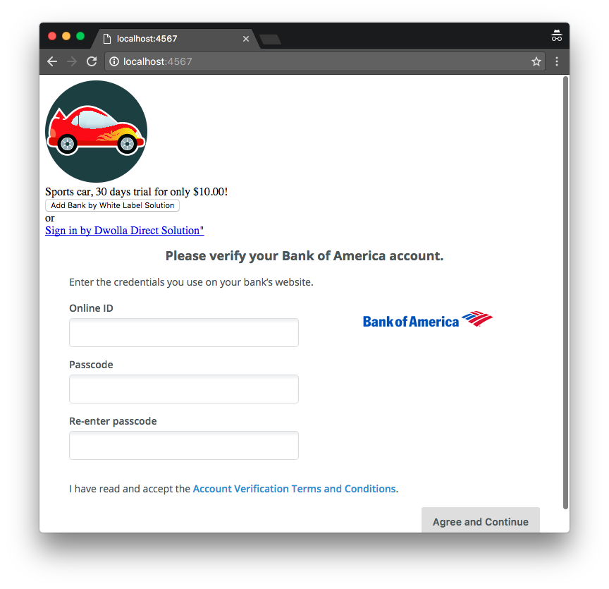

Kill Bill Dwolla demo
=====================

Inspired from the official [Using Checkout and Sinatra](https://stripe.com/docs/checkout/sinatra) guide, this sample app shows you how to integrate Dwolla tokenization feature with [Kill Bill subscriptions APIs](http://docs.killbill.io/0.16/userguide_subscription.html).

Prerequisites
-------------

Ruby 2.1+ or JRuby 1.7.20+ is recommended. If you don’t have a Ruby installation yet, use [RVM](https://rvm.io/rvm/install):

```
gpg --keyserver hkp://keys.gnupg.net --recv-keys 409B6B1796C275462A1703113804BB82D39DC0E3
\curl -sSL https://get.rvm.io | bash -s stable --ruby
```

After following the post-installation instructions, you should have access to the ruby and gem executables.

Install the dependencies by running in this folder:

```
gem install bundler
bundle install
```

This also assumes:

* Kill Bill is [already setup](http://docs.killbill.io/0.16/getting_started.html)
* The default tenant (bob/lazar) has been created
* The [Dwolla plugin](https://github.com/killbill/killbill-dwolla-plugin) is installed and configured

Run
---

To run the app:

```
KB_URL='http://<host>:<port>' DWOLLA_CLIENT_ID='<MERCHANT_DWOLLA_CLIENT_ID>' DWOLLA_CLIENT_SECRET='<MERCHANT_DWOLLA_CLIENT_SECRET>' DWOLLA_ACCESS_TOKEN='<MERCHANT_DWOLLA_ACCESS_TOKEN>' ruby app.rb
```

or if you are using Docker:

```
KB_URL='http://<host>:<port>' DWOLLA_CLIENT_ID='<MERCHANT_DWOLLA_CLIENT_ID>' DWOLLA_CLIENT_SECRET='<MERCHANT_DWOLLA_CLIENT_SECRET>' DWOLLA_ACCESS_TOKEN='<MERCHANT_DWOLLA_ACCESS_TOKEN>' ruby app.rb
```

Then go to [http://localhost:4567/](http://localhost:4567/) where you should see the Dwolla **Add Bank** button.

Select a Bank, follow the steps with dummy data and complete the checkout process.

This will:

* Get or create a Customer in Dwolla
* Tokenize the bank account in Dwolla
* Create a new Kill Bill account
* Add a default payment method on this account associated with this token
* Create a new subscription for the sports car monthly plan (with a $10 30-days trial)
* Charge the token for $10




